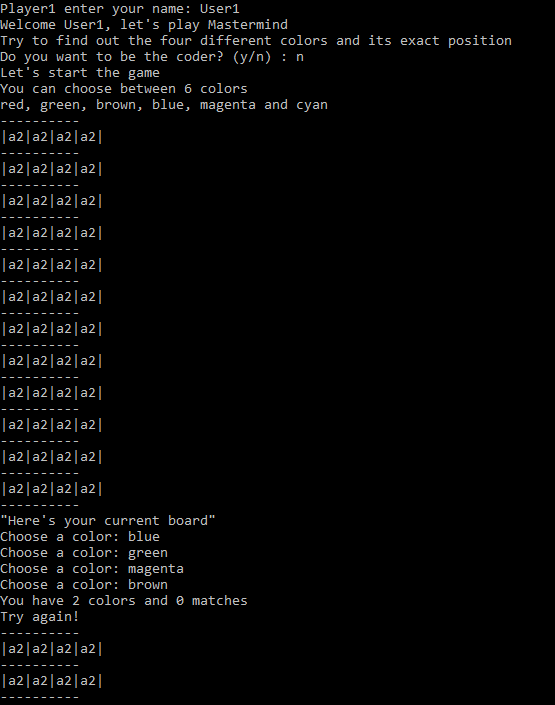

# Mastermind
I built a mastermind game on the command line. A human player can either solve the game themselves, or two users can play, one as the codemaker and the other as the player.

# What it does
One player plays Mastermind game

# Built With
- Ruby
- VSCode

# Live demo

You can find it here 

# Getting Started
Clone the project on your local machine, cd to the folder, and then run "./bin/start.rb" on your terminal

# Instructions to Play
- Select the player name.

- Select who wants to be the codemaker, the computer or a player.

- The code can be made up of any combination of the colored pegs. You may not use two or more pegs of the same color.

- The colors are red, green, brown, magenta ,blue and cyan.

- Once the code is set, the Decoder can begin guessing, trying to duplicate the exact colors and positions of the hidden Code pegs.

- Each guess is made by placing a row of Code pegs on the unit. 

- After every guess, the result of fails and matches will be displayed.

- Player has 15 tries.

# Prerequisites
- Install Ruby's latest version.

# Install
- Install VSCode or any code editor you like
- Install latest version of Ruby

# Run tests
- Run 'rspec' in the main directory

## Author

👤 **Javier Oriol Correas Sanchez Cuesta**

- Github: [@javitocor](https://github.com/javitocor)
- Twitter: [@JavierCorreas4](https://twitter.com/JavierCorreas4)
- Linkedin: [Javier Oriol Correas Sanchez Cuesta](https://www.linkedin.com/in/javier-correas-sanchez-cuesta-15289482/)

# Future Features
- Add AI to the game so it can play itself

# 🤝 Contributing
Contributions, issues and feature requests are welcome! Start by:

- Forking the project
- Cloning the project to your local machine
- cd into the project directory
- Run git checkout -b your-branch-name
- Make your contributions
- Push your branch up to your forked repository
- Open a Pull Request with a detailed description to the development branch of the original project for a review

# Attributions and Credit 🚀

# Show your support
Give a ⭐️ if you like this project!

📝 License

Check out my stories on medium to see what I'm talking about! Follow me on Instagram and Twitter to see what I am up to!

Enjoy!

